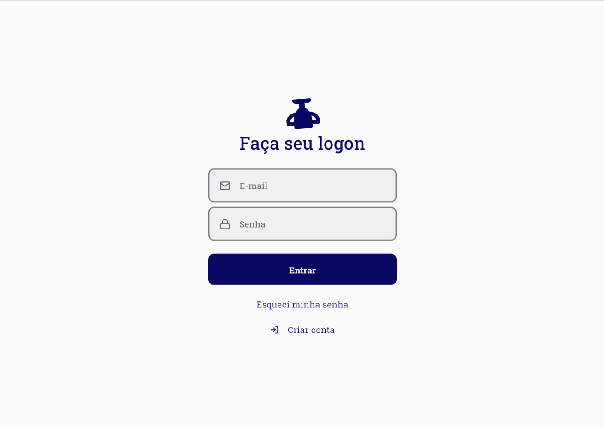

<h1 align="center"> Championship </h1>

  

  
	
  

  

  

  <a href="#-frontend">Demo</a>&nbsp;&nbsp;&nbsp;|&nbsp;&nbsp;&nbsp;
  <a href="#-project">Project</a>&nbsp;&nbsp;&nbsp;|&nbsp;&nbsp;&nbsp;
  <a href="#-technologies">Technologies</a>&nbsp;&nbsp;&nbsp;|&nbsp;&nbsp;&nbsp;
  <a href="#-backend">Backend</a>&nbsp;&nbsp;&nbsp;|&nbsp;&nbsp;&nbsp;
  <a href="#-frontend">Frontend</a>

## 👹  Demo

## 💻  Project

This is a football game scoring project.
It was created to train the use of reactjs libraries and record scores of FIFA games.

## 👾  Technologies

This project is being developed with the following technologies:

- [Node.js][nodejs]
- [ReactJS][reactjs]
- [Framer-Motion][framermotion]
- [Material-UI][materialui]
- [Styled-Components][styled]

## 🌚  Backend

...

## 🌕  Frontend

...

Made with ♥ by Eduardo Moritz :wave: [Get in touch!](https://www.linkedin.com/in/eduardo-moritz-5298a0118/)

[nodejs]: https://nodejs.org/
[reactjs]: https://reactjs.org/
[framermotion]: https://www.framer.com/motion/
[materialui]: https://material-ui.com/pt/
[styled]: https://styled-components.com/